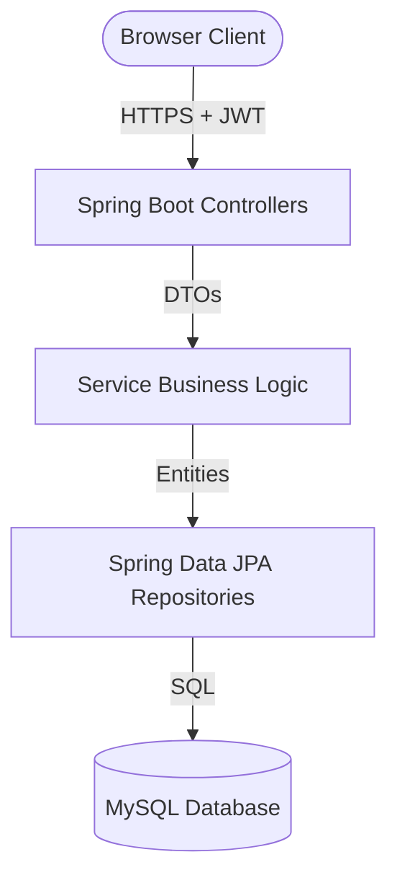
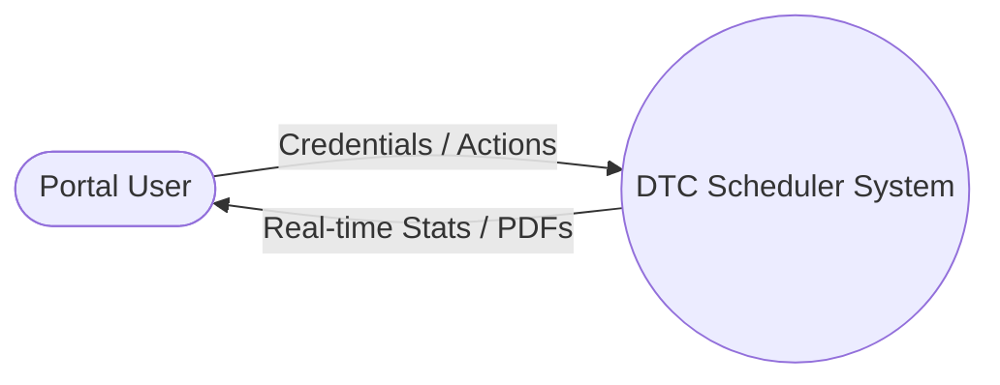
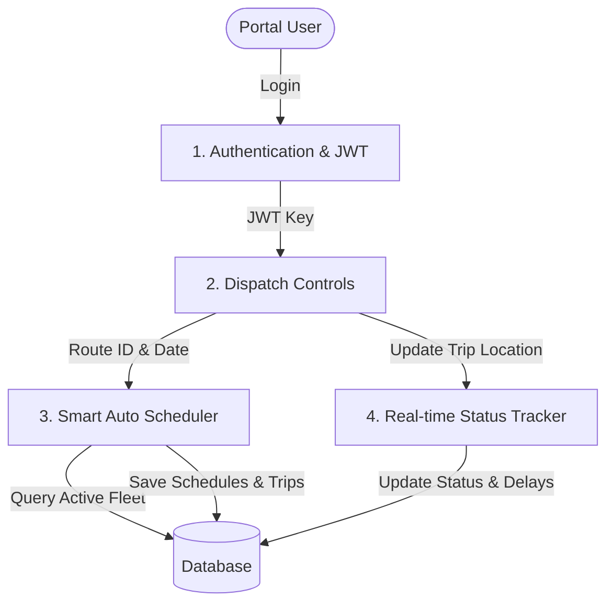
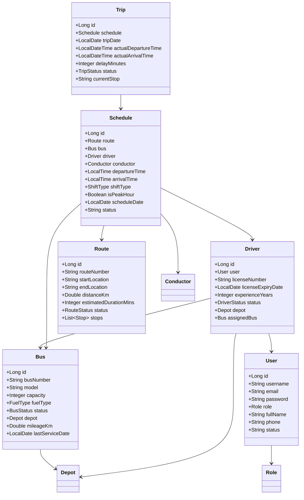
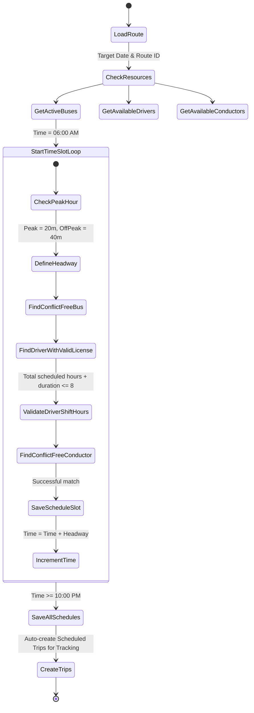
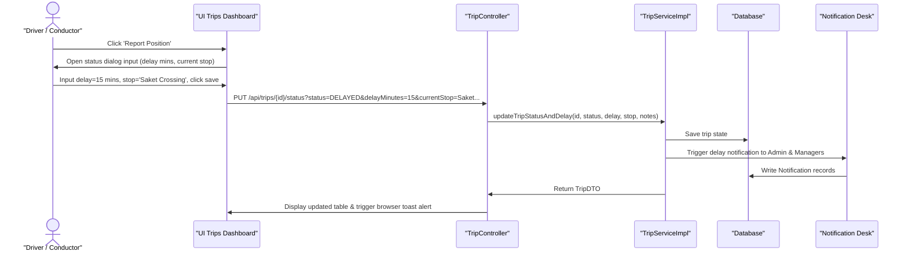

# Project Documentation: DTC Automated Bus Scheduling & Route Management System

## 1. Abstract
The **Automated Bus Scheduling and Route Management System** for Delhi Transport Corporation (DTC) is a full-stack, enterprise-grade web application designed to optimize fleet utilization, automate time-table dispatch, prevent crew booking conflicts, track live operation delays, and generate performance sheets. Built on Java Spring Boot and MySQL with a clean Bootstrap 5 glassmorphism front-end, it introduces a Smart Scheduling Algorithm enforcing labor constraints (max 8-hour shifts) and vehicle servicing checks to replace paper-log routing.

---

## 2. Introduction & Problem Statement
### 2.1 Existing System Issues
DTC's current operations rely heavily on manual logbooks, static timetable spreadsheets, and verbal crew check-ins. Key disadvantages include:
- **Resource Booking Conflicts**: Double-booking of drivers or buses on overlapping schedules.
- **Labor Compliance Violations**: Difficulty enforcing maximum shift guidelines (8 hours) and rest requirements.
- **Lack of Live Delay Reporting**: Delay occurrences are reported post-operation, making proactive rerouting impossible.
- **Inefficient Scheduling**: Failure to dynamically scale headway (trip intervals) during peak commuter hours (8 AM-11 AM, 5 PM-8 PM).

### 2.2 Proposed System
The proposed system digitizes operational workflows by introducing:
- **Centralized Database**: Unifying depots, buses, crew (drivers, conductors), and stops.
- **Smart Automatic Scheduling Algorithm**: Automatically maps available crew and vehicles to routes while strictly validating time conflicts, license expirations, and shift caps.
- **Live Operations Dashboard**: Tracks running statuses, logs delay minutes, and fires delay warning notifications.
- **Regulatory Reporting**: One-click PDF/Excel downloads of fleet status, crew profiles, and operations ledgers.

---

## 3. System Architecture & Diagrams

### 3.1 High-Level Web Architecture
The application follows a clean 3-tier architecture:
- **Client Tier**: Served from static HTML/CSS/JS, calling secure REST endpoints via dynamic AJAX wrappers.
- **Application Tier**: Spring Boot MVC Controllers -> Service Business Layer -> JPA/Hibernate Data layer.
- **Data Tier**: Relational MySQL database engine.



### 3.2 Data Flow Diagram (DFD)
#### Level 0: Context Diagram


#### Level 1: Operational Flow DFD


### 3.3 Use Case Diagram
```mermaid
leftToRightDirection
actor Admin as "Administrator"
actor Scheduler as "Timetable Scheduler"
actor Driver as "Driver / Conductor"

rectangle DTCSystem {
    usecase UC1 as "Manage Fleet (CRUD)"
    usecase UC2 as "Manage Crew (CRUD)"
    usecase UC3 as "Run Smart Auto-Scheduler"
    usecase UC4 as "Start/End Trip"
    usecase UC5 as "Log Delay & Location"
    usecase UC6 as "Download Operational Reports"
    usecase UC7 as "Backup/Restore Database"
}

Admin --> UC1
Admin --> UC2
Admin --> UC7
Admin --> UC6
Scheduler --> UC3
Scheduler --> UC6
Driver --> UC4
Driver --> UC5
```

### 3.4 Class Diagram


### 3.5 Activity Diagram: Automated Scheduling Engine


### 3.6 Sequence Diagram: Live Delay Reporting


---

## 4. Modules Description
1. **Authentication (JWT & RBAC)**: Handles login, password updates, and parses Bearer tokens to identify Roles (Admin, Depot Manager, Scheduler, Driver, Conductor) for method-level security access.
2. **Dashboard Statistics**: Compiles counters and distributions dynamically using database aggregates (e.g. active counts, delay indexes, fuel ratio ratios).
3. **Bus Fleet Management**: Full CRUD mapping to add vehicles, set depot houses, log mileage, and modify operational flags.
4. **Driver & Crew Registry**: Integrates licensing validation (alerting upcoming expiries under 30 days) and connects driver/conductor availability to schedules.
5. **Route Details**: Custom routes builder, allowing sorting, re-sequencing, and editing of stops.
6. **Schedule Planner (Auto/Manual)**: The core system service. Auto-allocates crew and vehicles avoiding booking clashes and shift overlaps.
7. **Live Tracker (Trip Desk)**: Real-time status tracker changing scheduled trips to en-route, completed, or delayed statuses.
8. **Maintenance & Repairs**: Log breakdown repairs, service records, and technician notes. Puts buses in `MAINTENANCE` status automatically.
9. **Report Center**: Translates JPA logs into structured Excel sheets (via Apache POI) and A4 PDF files (via OpenPDF).

---

## 5. Testing Report

### 5.1 JUnit Automated Test Cases
We configured test classes testing core validation rules:
- **`BusManagementApplicationTests`**: Confirms context bootstrap.
- **`ScheduleServiceTest`**: 
  - `testCreateSchedule_DriverOverlapConflict`: Verifies that attempting to allocate a driver to overlapping schedules on the same day throws a `BadRequestException` validation warning.
  - `testCreateSchedule_DriverShiftHoursExceeded`: Verifies that if a driver's daily scheduled durations exceed 8 hours, the system blocks the allocation.

### 5.2 Manual API Verification Matrix
| Endpoint | Method | Payload (JSON) | Expected Response Code | Business Rule Verified |
|---|---|---|---|---|
| `/api/auth/login` | POST | `{"username":"admin","password":"admin123"}` | 200 OK | Authenticates user and returns Bearer token |
| `/api/schedules` | POST | `{"routeId":1, "busId":1, "driverId":1, ...}` | 400 Bad Request | Blocks manual allocation if driver is busy |
| `/api/trips/1/start` | PUT | None | 200 OK | Changes trip status and sets driver status to ON_TRIP |
| `/api/reports/buses/pdf` | GET | None | 200 OK | Downloads PDF binary stream |

---

## 6. Future Enhancements
- **GPS Tracker Integration**: Interface real-time GPS telemetry from bus hardware directly into the live delay mapping page.
- **Passenger Mobile Application**: Build public schedules dashboards enabling commuters to search route numbers and view estimated times of arrival (ETAs) calculated from live delay logs.
- **AI-Based Demand Prediction**: Adjust headway schedules dynamically by integrating seasonal public holidays and historic commuter load logs.

---

## 7. Conclusion & References
The DTC Automated Bus Scheduling and Route Management System provides a secure, clean, and optimized platform to run daily operations. By introducing smart conflict prevention algorithms, compliance shift checks, and real-time alerts, it reduces resource wastage and improves commuter satisfaction.

### References
1. Spring Boot Security & Authentication Guidelines (Spring Docs 6.x)
2. JWT Implementation RFC 7519 Specifications
3. MySQL Database Normalization & Index Optimization Best Practices
4. Delhi Transport Corporation (DTC) Fleet Operational Headway Manuals
